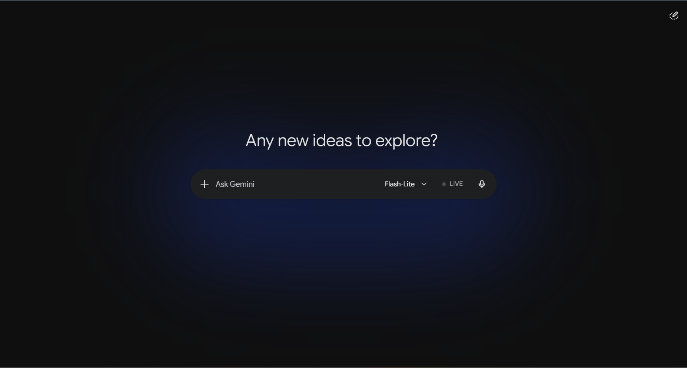
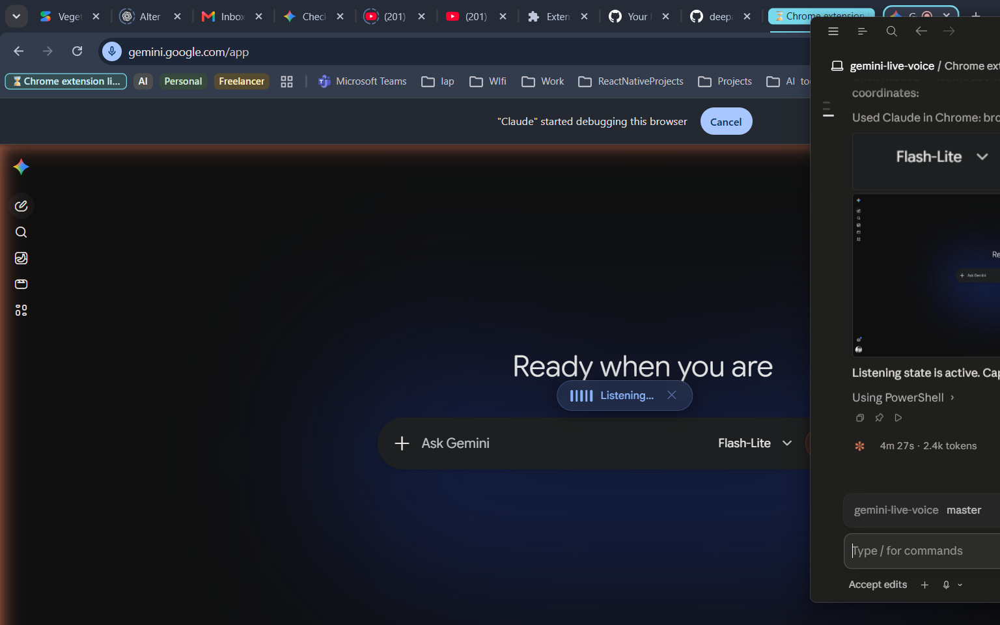
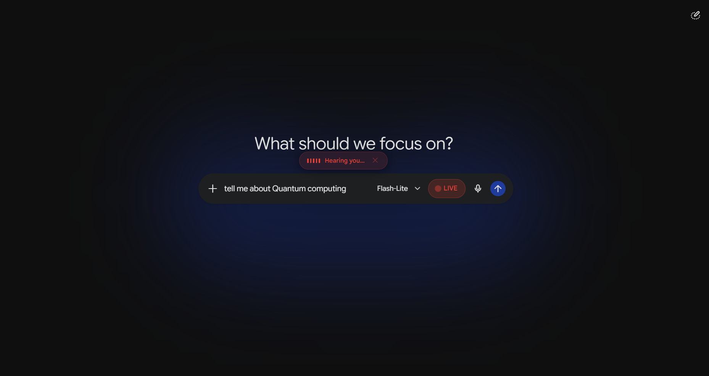

# Gemini Live Voice

> **Continuous, hands-free voice input for Google Gemini — words appear in real time as you speak, and your message sends automatically on pause.**

[](https://developer.chrome.com/docs/extensions/develop/migrate/what-is-mv3)
[](https://wicg.github.io/speech-api/)
[](LICENSE)
[](https://gemini.google.com/app)

---

## Why this exists

Google Gemini on desktop only has a **click-to-record** mic — you press, speak, release, send. On mobile you get true live dictation. This extension brings that mobile-style continuous voice experience to desktop Chrome, using the **same browser speech engine** Gemini already uses — no API key, no external service, no data leaves your browser.

---

## Screenshots

| Idle — extension ready | Listening — mic active | Speaking — transcribing in real time |
|------------------------|------------------------|--------------------------------------|
|  |  |  |

---

## Features

- **Real-time transcription** — interim words appear in the Gemini input box as you speak
- **Continuous listening** — automatically restarts after each recognition session so you never have to click again
- **Auto-send on silence** — after ~1.5 s of silence the message is sent; keeps the conversation flowing hands-free
- **Zero configuration** — no API key, no accounts, no permissions beyond your browser mic
- **Keyboard shortcut** — `Ctrl + Shift + L` toggles live mode from anywhere on the page
- **Visual indicator** — a floating pill above the input box shows _Listening…_ / _Hearing you…_ / _Sending…_
- **Adaptive language** — picks up the browser / page language automatically (`navigator.language`)
- **Dark & light theme** — styles match Gemini's own colour scheme in both modes
- **Survives navigation** — a MutationObserver re-injects the button after Angular SPA re-renders

---

## Installation

> The extension is not on the Chrome Web Store — load it unpacked in Developer Mode (30 seconds).

### Step 1 — Download the extension

Click **Code → Download ZIP** on this page, then unzip it anywhere on your computer.

_Or clone with Git:_
```bash
git clone https://github.com/YOUR_USERNAME/gemini-live-voice.git
```

### Step 2 — Open Chrome Extensions

Navigate to `chrome://extensions` in your browser address bar.

### Step 3 — Enable Developer Mode

Toggle **Developer mode** in the top-right corner of the extensions page.

### Step 4 — Load the extension

Click **Load unpacked** and select the folder you downloaded/unzipped (the one that contains `manifest.json`).

The **Gemini Live Speech** extension will appear in your list with a green toggle.

### Step 5 — Open Gemini

Go to [https://gemini.google.com/app](https://gemini.google.com/app).  
You will see a new **● LIVE** button to the left of the microphone button in the chat toolbar.

---

## Usage

### Starting a session

1. Click the **LIVE** button (or press `Ctrl + Shift + L`).
2. If prompted, allow microphone access for `gemini.google.com`.
3. The button turns **red** and the indicator pill appears above the input box — _Listening…_

### Speaking

- Speak naturally. Words appear in the Gemini input box in real time.
- The indicator switches to **_Hearing you…_** while your voice is detected.
- After ~1.5 seconds of silence, the message is **sent automatically** and the extension returns to _Listening…_ for your next message.

### Stopping

- Click the **LIVE** button again, press `Ctrl + Shift + L`, or click the **✕** on the indicator pill.

### Keyboard shortcut

| Action | Shortcut |
|--------|----------|
| Toggle Live Voice on / off | `Ctrl` + `Shift` + `L` |

---

## How it works

```
Browser mic
    │
    ▼
webkitSpeechRecognition          ← same engine Gemini uses natively
  continuous: true
  interimResults: true
    │
    ├── interim results → injected into Quill editor in real time
    │                     via execCommand('insertText') — triggers
    │                     Angular change detection without XSS risk
    │
    └── 1.5 s silence  → autoSubmit() clicks Gemini's send button
```

- **No background service worker** — the extension is a single content script; it runs only on `gemini.google.com` and only while the tab is open.
- **No network requests** — speech is processed entirely by Chrome's built-in engine.
- **MV3 compliant** — uses Manifest V3 with minimal permissions (`host_permissions` scoped to `gemini.google.com` only).

---

## Privacy

| What | Detail |
|------|--------|
| Microphone | Used only when LIVE mode is active (you click the button) |
| Speech data | Processed by Chrome's built-in `webkitSpeechRecognition` — the same engine Gemini desktop uses for its own mic button |
| External requests | None — the extension makes zero network calls |
| Permissions | `host_permissions: ["https://gemini.google.com/*"]` — no access to any other site |
| Storage | Nothing is stored locally or remotely |

---

## Browser compatibility

| Browser | Status |
|---------|--------|
| Google Chrome 90+ | ✅ Fully supported |
| Microsoft Edge 90+ (Chromium) | ✅ Supported |
| Firefox | ❌ `webkitSpeechRecognition` not available |
| Safari | ❌ Chrome extensions not supported |

---

## Project structure

```
gemini-live-voice/
├── manifest.json       # MV3 extension manifest
├── content.js          # All logic: recognition, UI injection, auto-submit
├── content.css         # LIVE button + indicator pill styles (dark & light)
├── icons/
│   ├── icon16.png
│   ├── icon48.png
│   └── icon128.png
├── screenshots/        # README screenshots (add your own)
├── LICENSE             # MIT
└── .gitignore
```

---

## Contributing

Pull requests are welcome! A few areas worth exploring:

- **Configurable silence delay** — let users set how long to wait before auto-send
- **Manual send toggle** — option to disable auto-send and use Enter instead
- **Chrome Web Store listing** — packaging and privacy policy for public distribution
- **Firefox port** — adapt to use the standard `SpeechRecognition` API when available

To contribute:
1. Fork the repo
2. Create a feature branch (`git checkout -b feature/my-feature`)
3. Commit your changes
4. Open a Pull Request

---

## License

[MIT](LICENSE) © 2025 Deepak Raj
